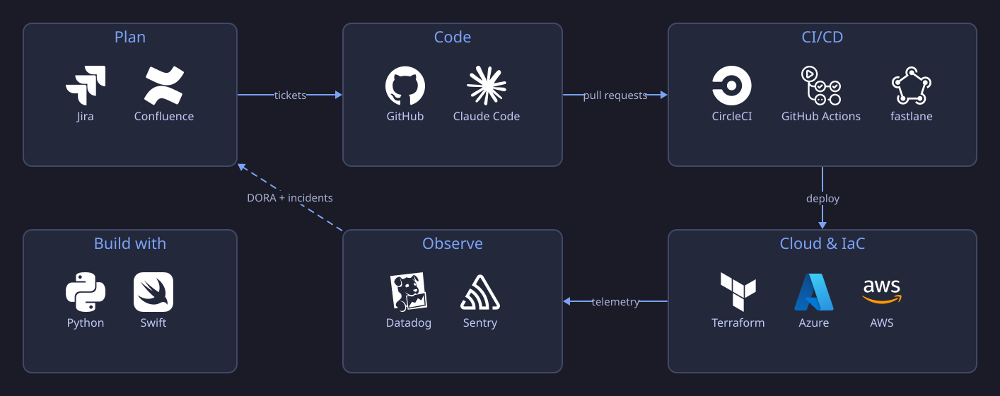

<!-- markdownlint-disable MD033 MD041 MD013 -->

## Overview

**Senior Manager, DevOps & Engineering Leadership** · Atlanta, GA

- 👥 **Lead DevOps & QA automation teams** — CI/CD, infrastructure, and
  developer experience
- 🏗️ **Platform & cloud architecture** — AWS, Azure, Terraform
- 🤖 **AI-native DevEx** — Claude Code in CI, code review, and automation
- 🧩 **Atlassian platform** — Jira admin and Forge app development
- 📱 **Apple platforms** — Swift, SwiftUI, Fastlane

- [Overview](#overview)
- [Stack](#stack)
- [Open source](#open-source)

## Stack

| Area | Tools |
| ---- | ----- |
| **Cloud & IaC** | AWS · Azure · Terraform |
| **Languages** | Python · Swift/SwiftUI · TypeScript · Bash |
| **CI/CD & DevEx** | CircleCI · GitHub Actions · Fastlane · Claude Code · D2 |
| **Atlassian** | Jira · Confluence · Forge |
| **Quality & observability** | Qlty · Sentry · Datadog · New Relic |

## Open source

| Project | What it is |
| ------- | ---------- |
| [ios-orb](https://github.com/kevnm67/ios-orb) | CircleCI orb for iOS build, test, and Fastlane release pipelines |
| [ci-failure-notifier](https://github.com/kevnm67/ci-failure-notifier) | CircleCI orb for instant CI failure notifications via Telegram |
| [MobileCI](https://github.com/kevnm67/MobileCI) | Reference iOS app wired end-to-end through CircleCI |
